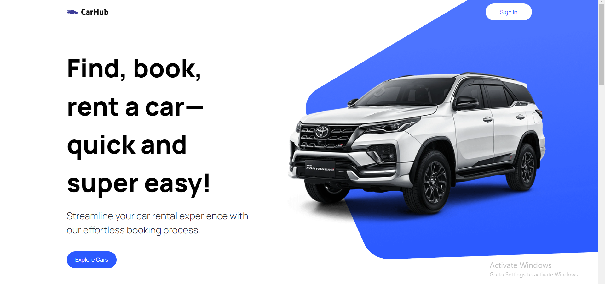
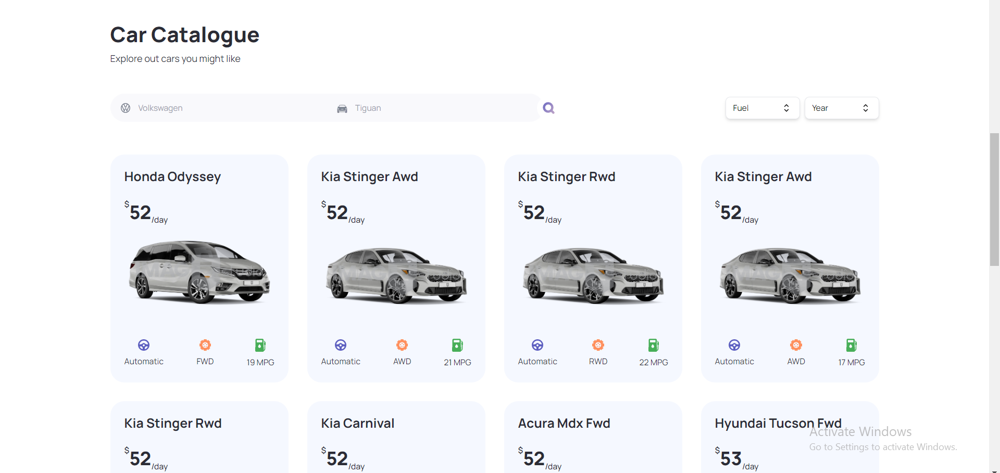
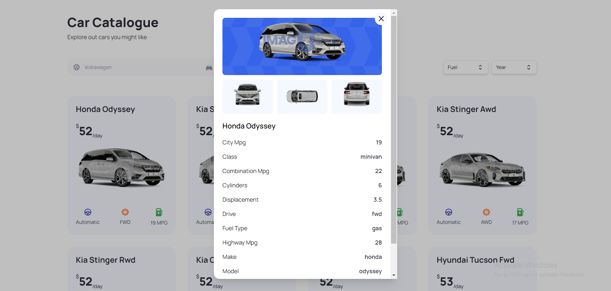

# Car Showcase Project
Hi There, This is a Project I worked on it with Next.js (App Router) and TypeScript and using HeadlessUI Library to add some Components and Transitions.

The Advantages of this website is : 
1- Have an advanced search functionalities and custom filters

2- Server side rendering for a best Performance

3- Optimizing metadata and SEO

4- Show Details for every car

I worked with Radid API to get all information for cars and IMAGIN.studio API to get pictures of cars

[This is the link to show Project](https://car-showcase-ten-beta.vercel.app/)

I wish you Like it.

